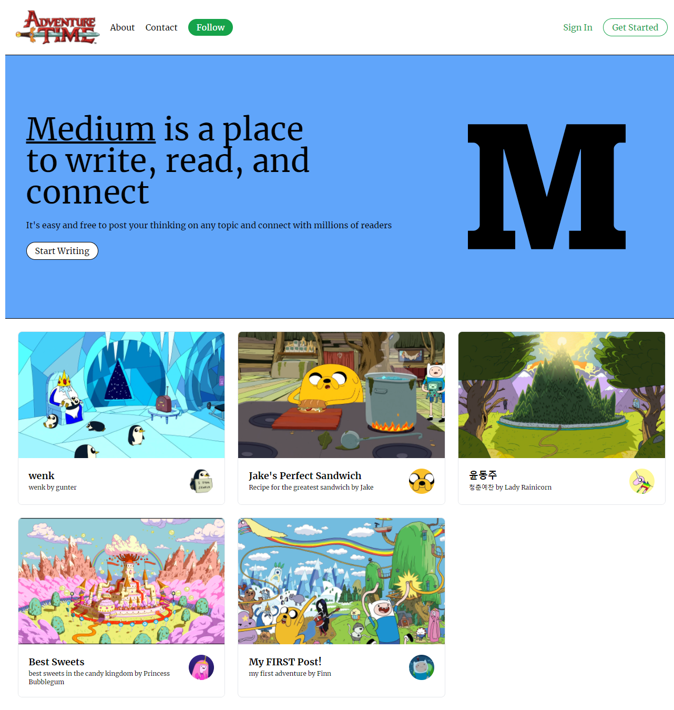

# Adventure Time Blog - (Medium Clone)

A Full Stack adventure time themed blog app, allowing posts to be created from Sanity CMS backend.

---

## Screenshot

## Technology Stack
- Typescript
- Next.js
- React
- Tailwind CSS
- Sanity CMS

## Features

- Connection to Sanity CMS backend
- Responsive Layout
- Author creation
- Post creation
- Public comments posting feature (with display on moderator approval)

## Motivation

I mainly wanted to create a project that uses Typescript in order to get more comfortable with writing type definitions. The fullstack implementation was just a bonus as I got to play around with Next.js API routes and connecting a Sanity CMS backend to a frontend client. 

I enjoyed learning and thinking through about the schemas that I needed to consider while working with Sanity CMS. I think thinking through the entire database design helps me learn more deeply about how to create and store data.

The theming was just a fun bonus (and so I wouldn't run out of ideas to write dummy data)

I completely underestimated the power of Typescript, and I think I've fallen in love with using typescript and will continue to incorporate typescript into my projects

---

## Author
Ian Wu

- LinkedIn - [@iannnop](https://www.linkedin.com/in/iannnop/)
- Instagram - [@iannnop_frontend](https://www.instagram.com/iannnop_frontend/)
- Twitter - [@iannnop](https://www.twitter.com/iannnop)
